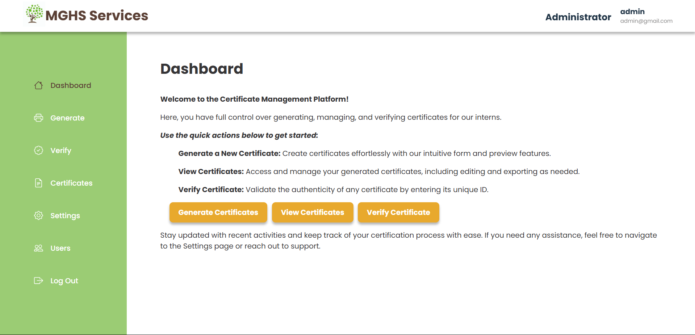
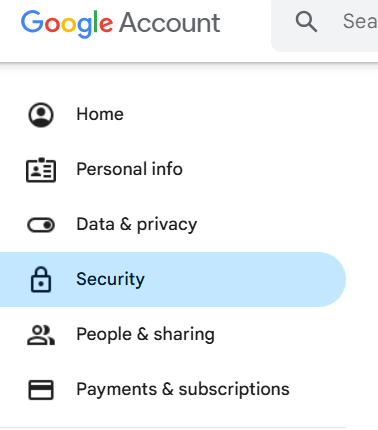
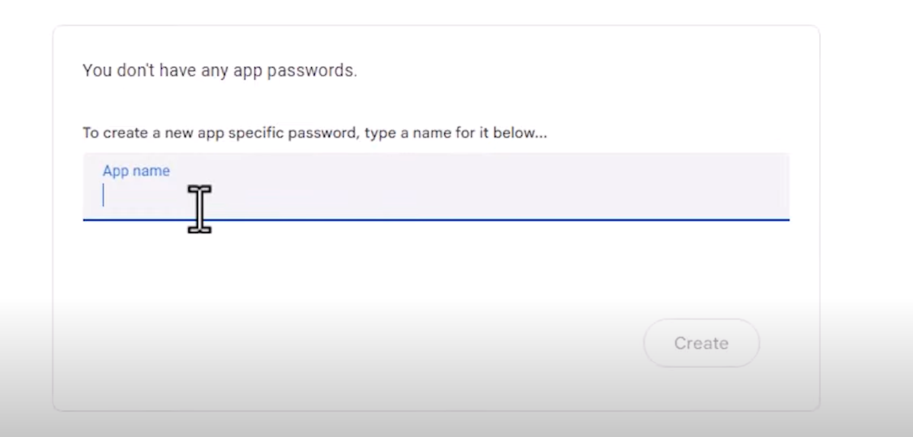
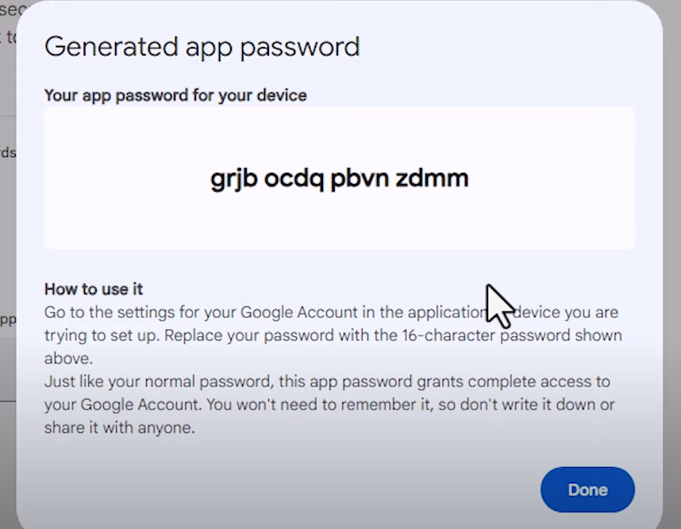

# MGHS Intern Certificate Management



This project proposal aims to develop a comprehensive website for generating and managing certificates. The envisioned platform will provide a suite of features to enhance the certification process. Key functionalities include the verification of certificates, options for printing and sharing, multi-language support, and various customization tools. Additionally, the system will incorporate an export function to delete the certificate from the database upon export automatically and complete automation process of certificate generation in wordpress. Despite removing the certificate, the system will retain a textual record of the intern's details and certification history. This project seeks to streamline the certification process, ensuring efficiency, accuracy, and accessibility.

## Email Configuration

This guide provides step-by-step instructions to update the email configuration for the application that uses Gmail's SMTP server to send emails.

### 1. Set Up a Gmail Account and Enable 2-Step Verification

- Create a new Gmail account (if you don’t already have one dedicated for the application).
- Go to your Google account and click on Security.
  
- Enable 2-Step Verification (follow the instructions to set it up)
  

### 2. Generate an App Password

- On the same Security page, click on App Passwords (you will only see this option if 2-Step Verification is enabled).
- Enter the name of the app then click Create.
  
- Copy the 16-character app password that Google provides. This password will replace the current one in the `sendEmail.php`.
  

### 2. Update the `sendEmail.php` File

- Replace the following lines with the new app password you generated:
  ```php
  define('MAILHOST', "smtp.gmail.com");
  define('PASSWORD', "newly_generated_app_password");
  ```
- Update the email address
  ```php
  $mail->Username   = 'your_new_email@gmail.com';
  $mail->setFrom('your_new_email@gmail.com', 'Your Name');
  $mail->addReplyTo('your_new_email@gmail.com', 'Your Name');
  ```
